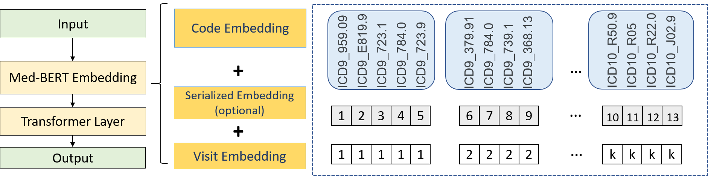

# Med-BERT
This repository provides the code for pre-training and fine-tuning Med-BERT, a contextualized embedding model that delivers a meaningful performance boost for real-world disease-prediction problems as compared to state-of-the-art models.

### Overview
Med-Bert adapts bidirectional encoder representations from transformers (BERT) framework and pre-trains contextualized embeddings for diagnosis codes mainly in ICD-9 and ICD-10 format using structured data from an EHR dataset containing 28,490,650 patients. 
 
Please refer to our paper [Med-BERT: pre-trained contextualized embeddings on large-scale structured electronic health records for disease prediction](https://arxiv.org/abs/2005.12833) for more details.

  
## Reproduce Med-BERT
#### Pretraining

To reproduce the steps necessary for pre-training Med-BERT

    python preprocess_pretrain_data.py <data_File> <vocab/'NA'> <output_Prefix> <subset_size/0forAll>
    python create_BERTpretrain_EHRfeatures.py --input_file= <output_Prefix.bencs.train> --output_file='output_file' --vocab_file=<output_Prefix.types>--max_predictions_per_seq=1 --max_seq_length=64
    python run_EHRpretraining.py --input_file='output_file' --output_dir=<path_to_outputfolder> --do_train=True --do_eval=True --bert_config_file=config.json --train_batch_size=32 --max_seq_length=512 --max_predictions_per_seq=1 --num_train_steps=4500000   --num_warmup_steps=10000 --learning_rate=5e-5

You can find an example for the construction of the data_file under [Example data](Pretraining%20Code/Data%20Pre-processing%20Code/Example%20data) as well as images showing the construction of preprocessed data and the BERT features

#### Fine-tuning Tutorial

To see an example of how to use Med-BERT for a specific disease prediction task, you can follow the [Med-BERT DHF prediction notebook](Fine-Tunning%20Tutorials/predicting_DHF_MED_BERT_LR.ipynb)

Kindly note that you need to use the following code for preparing the fine-tunning data using (create_ehr_pretrain_FTdata.py) in a similar way of preparing the pretraining data.

### Dependencies
    Python: 3.7+
    Pytorch 1.5.0
    Tensorflow 1.13.1+
    Pandas
    Pickle
    tqdm
    pytorch-transformers
    Google BERT
    

### Results
  
<B>Prediction results for the evaluation sets by training on different sizes of data on DHF-Cerner (top), PaCa-Cerner (middle), and PaCa-Truven (bottom). The shadows indicate the standard deviations. Please refer to our paper for more details.
 
### Contact

Please post a Github issue if you have any questions.

### Citation

Please acknowledge the following work in papers or derivative software:

Laila Rasmy, Yang Xiang, Ziqian Xie, Cui Tao, and Degui Zhi. "Med-BERT: pre-trained contextualized embeddings on large-scale structured electronic health records for disease prediction." arXiv preprint arXiv:2005.12833 (2020).

